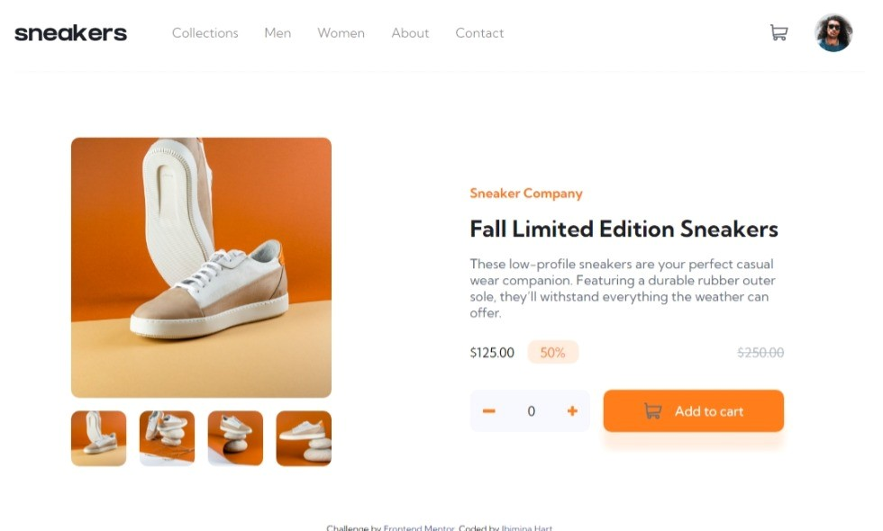

# Frontend Mentor - E-commerce product page solution

This is a solution to the [E-commerce product page challenge on Frontend Mentor](https://www.frontendmentor.io/challenges/ecommerce-product-page-UPsZ9MJp6). Frontend Mentor challenges help you improve your coding skills by building realistic projects.

## Table of contents

- [Overview](#overview)
  - [The challenge](#the-challenge)
  - [Screenshot](#screenshot)
  - [Links](#links)
- [My process](#my-process)
  - [Built with](#built-with)
  - [What I learned](#what-i-learned)
  - [Continued development](#continued-development)
  - [Useful resources](#useful-resources)
- [Author](#author)
- [Acknowledgments](#acknowledgments)


## Overview

### The challenge

Users should be able to:

- View the optimal layout for the site depending on their device's screen size
- See hover states for all interactive elements on the page
- Open a lightbox gallery by clicking on the large product image
- Switch the large product image by clicking on the small thumbnail images
- Add items to the cart
- View the cart and remove items from it

### Screenshot

d.png)



### Links

- Solution URL: (https://github.com/ibimina/ecommerce-product-page-main)
- Live Site URL: (https://ibimina.github.io/ecommerce-product-page-main/)


## My process

### Built with

- Semantic HTML5 markup
- CSS custom properties
- Flexbox
- CSS Grid
- Mobile-first workflow


### What I learned
I used this function to control the display of image when the arrow button is clicked 

```js
function leftSlide(image) {
  reset(image);
  if (current === 0) {
    current = image.length;
  }
  image[current - 1].style.display = "block";
  current--;
}
```

and 
to override  the light box image
```js
btnContainer.addEventListener("click", (e) => {
  let somw = e.target;
  console.log(somw);
  if (somw.classList.contains("thumbone")) {
    largeImg.innerHTML = ``;
  } else if (somw.classList.contains("thumbtwo")) {
    largeImg.innerHTML = ``;
  } else if (somw.classList.contains("thumbthree")) {
    largeImg.innerHTML = ``;
  } else if (somw.classList.contains("thumbfour")) {
    largeImg.innerHTML = ``;
  }
});
```


### Continued development
Working on Mobile design web page and image slider


## Author

- Ibimina Hart
- Frontend Mentor - [@ibimina](https://www.frontendmentor.io/profile/ibimina)
- Twitter - [@ibiminaaH](https://www.twitter.com/ibiminaaH)


